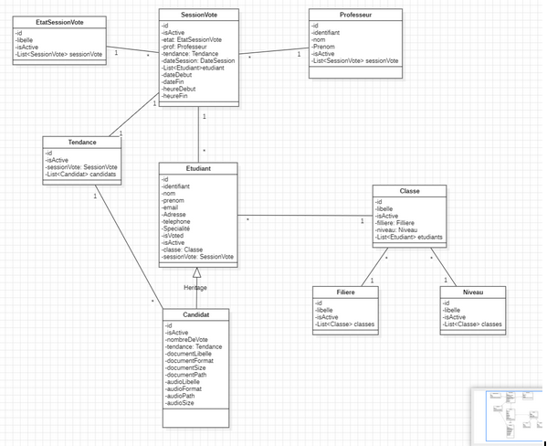
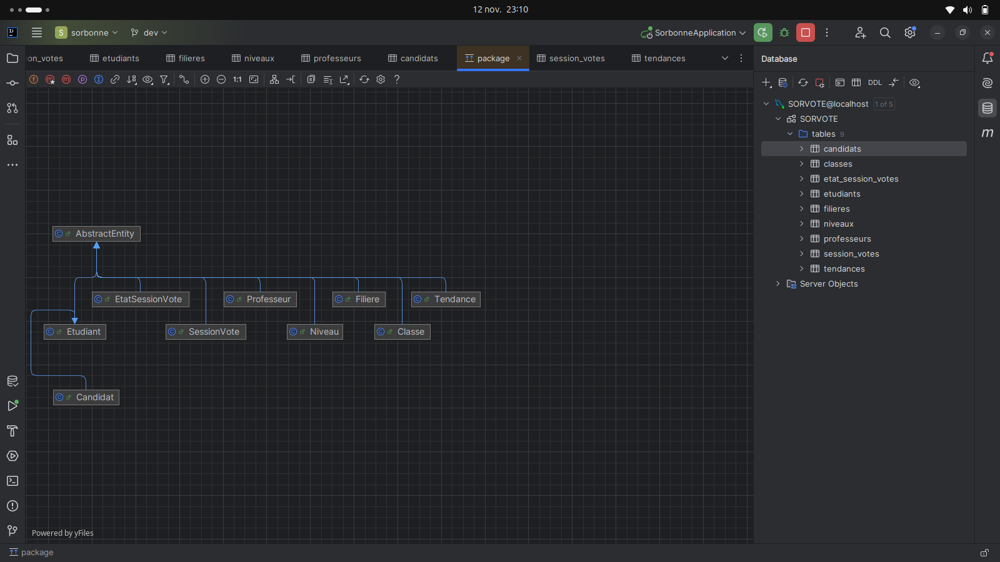

# SorVote API

### UML

# les usecases 
- creer une sessions de vote 
- lister les etudiants
- filtrer les etudiant par niveau et filiere
- inscrire un etudiant au vote
- desinscrire un etudiant au vote
- lire le document de l'étudiant
- lister les sessions de vote
- filtrer les sessions de vote niveau et filiere
- lister le tendance du sessions de vote
- lister le nombre de vote d'un candidat
- se connecter 
- se deconnecter 
- 